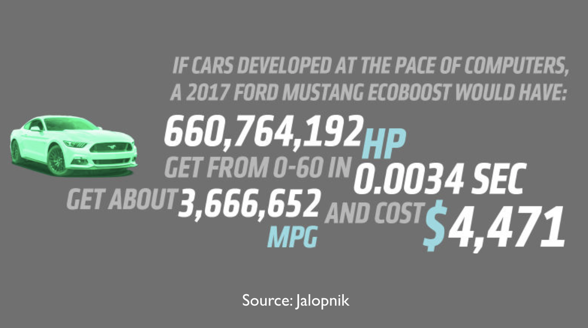
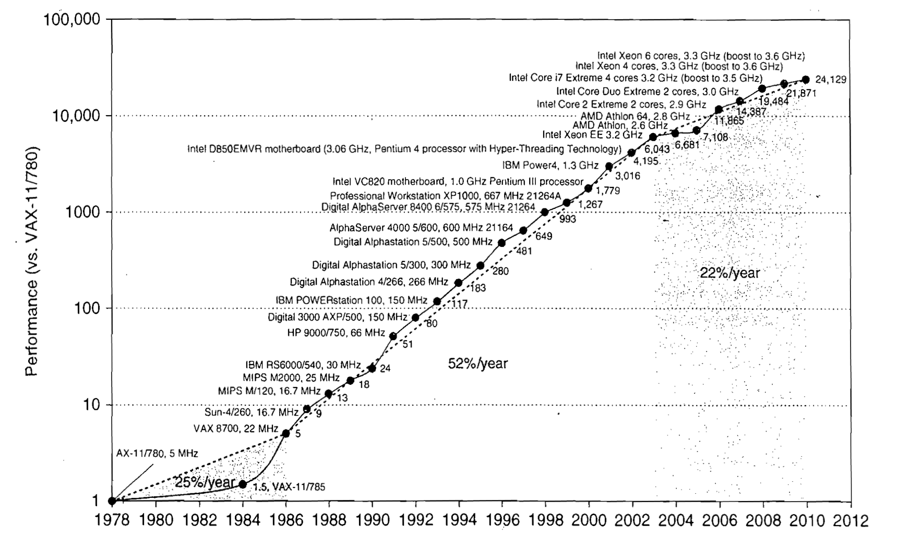
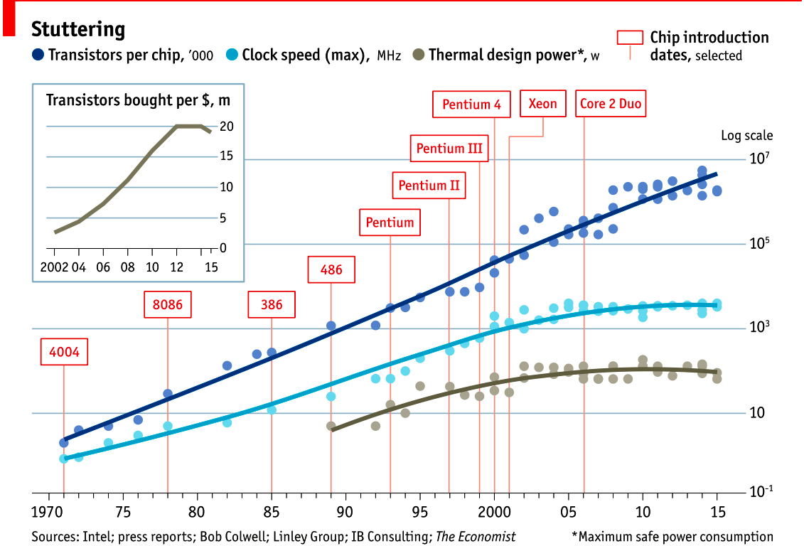
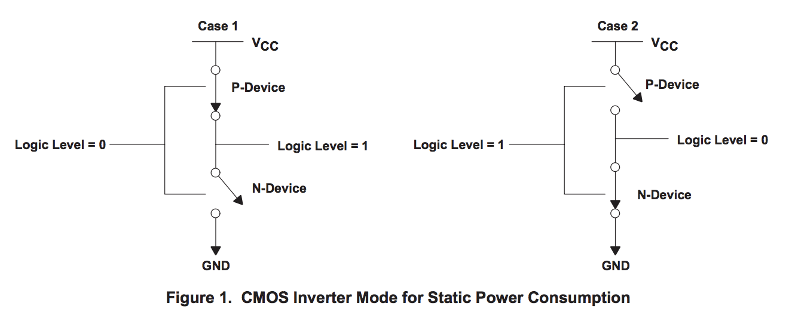
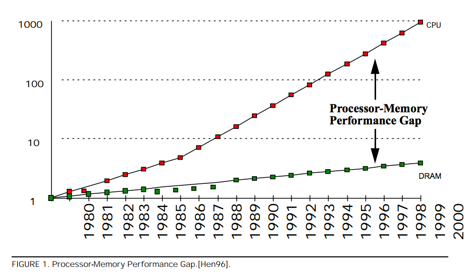
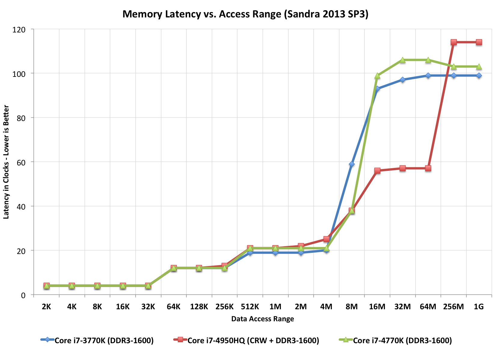
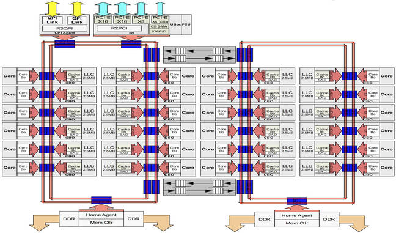

# The past and future of Microprocessor performance

This is a workshop about writing high performance code. In other workshops I talk about decoupled design and maintainability, but we’re here today to talk about performance.

I want to start today with a short lecture on how I think about the history of the evolution of computers and why I think writing high performance software is important .

The reality is that software runs on hardware, so to talk about writing high performance code, first  we need to talk about the hardware that runs our code.

## Mechanical Sympathy 

There is a term in popular use at the moment, you’ll hear people like Martin Thompson or Bill Kennedy talk about “mechanical sympathy”.

The name "Mechanical Sympathy" comes from the great racing car driver Jackie Stewart, who was a 3 times world Formula 1 champion. He believed that the best drivers had enough understanding of how a machine worked so they could work in harmony with it. 

To be a great race car driver, you don’t need to be a great mechanic, but you need to have more than a cursory understanding of how a motor car works.

I believe the same is true for us as software engineers. I don’t think any of us in this room will be a professional CPU designer, but that doesn’t mean we can ignore the problems that CPU designers face.

## Six orders of magnitude

There’s a common internet meme that goes something like this;

Of course this is preposterous, but it underscores just how much has changed in the computing industry.

As software authors all of us in this room have benefited from Moore's Law, the doubling of the number of available transistors on a chip every 18 months, for 50 years. **No other industry has experienced a four order of magnitude improvement in their tools in the space of a lifetime**.

But this is all changing.

## Are computers still getting faster?

So the fundamental question is, confronted with statistic like the ones in the image above, should we ask the question _are computers still getting faster_?

If computers are still getting faster then maybe we don’t need to care about the performance of our code, we just wait a bit and the hardware manufacturers will solve our performance problems for us.

### Let's look at the data

This is the classic data you’ll find in textbooks like *Computer Architecture, A Quantitative Approach* by John L. Hennessy and David A. Patterson. This graph was taken from the 5th edition

In the 5th edition, Hennessey and Patterson argue that there are three eras of computing performance

- The first was the 1970’s and early 80’s which was the formative years. Microprocessors as we know them today didn’t really exist, computers were built from discrete transistors or small scale integrated circuits. Cost, size, and the limitations in the understanding of material science were the limiting factor.
- From the mid 80s to 2004 the trend line is clear. Computer integer performance improved on average by 52% each year. Computer power doubled every two years, hence people conflated Moore’s law — the doubling of the number of transistors on a die, with computer performance.
- Then we come to the third era of computer performance. Things slow down. The aggregate rate of change is 22% per year. 

That previous graph only went up to 2012, but fortunately in 2012 [Jeff Preshing][0] wrote a [tool to scrape the Spec website and build your own graph][1].

So this is the same graph using Spec data from 1995 til 2017.

To me, rather than the step change we saw in the 2012 data, I’d say that _single core_ performance is approaching a limit. The numbers are slightly better for floating point, but for us in the room doing line of business applications, this is probably not that relevant.

### Yes, computer are still getting faster, slowly

> The first thing to remember about the ending of Moore's law is something Gordon Moore told me. He said "All exponentials come to an end". -- [John Hennessy][2]

This is Hennessy's quote from Google Next 18 and his Turing Award lecture. His contention is yes, CPU performance is still improving. However, single threaded integer performance is still improving around 3% per year. At this rate its going to take 20 years of compounding growth to double integer performance. Compare that to the go-go days of the 90's where performance was doubling every two years.

Why is this happening?

## Clock speeds

This graph from 2015 demonstrates this well. The top line shows the number of transistors on a die. This has continued in a roughly linear trend line since the 1970's. As this is a log/lin graph this linear series represents exponential growth.

However, If we look at the middle line, we see clock speeds have not increased in a decade, we see that cpu speeds stalled around 2004

The bottom graph shows thermal dissipation power; that is electrical power that is turned into heat, follows a same pattern--clock speeds and cpu heat dissipation are correlated.

## Heat

Why does a CPU produce heat? It's a solid state device, there are no moving components, so effects like friction are not (directly) relevant here.

This digram is taken from a great [data sheet produced by TI][7]. In this model the switch in N typed devices is attracted to a positive voltage P type devices are repelled from a positive voltage.

The power consumption of a CMOS device, which is what every transistor in this room, on your desk, and in your pocket, is made from, is combination of three factors.

1. Static power. When a transistor is static, that is, not changing its state, there is a small amount of current that leaks through the transistor to ground. The smaller the transistor, the more leakage. Leakage increases with temperature. Even a minute amount of leakage adds up when you have billions of transistors!
2. Dynamic power. When a transistor transitions from one state to another, it must charge or discharge the various capacitances it is connected to the gate. Dynamic power per transistor is the voltage squared times the capacitance and the frequency of change. Lowering the voltage can reduce the power consumed by a transistor, but lower voltages causes the transistor to switch slower.
3. Crowbar, or short circuit current. We like to think of transistors as digital devices occupying one state or another, off or on, atomically. In reality a transistor is an analog device. As a switch a transistor starts out _mostly_ off, and transitions, or switches, to a state of being _mostly_ on. This transition or switching time is very fast, in modern processors it is in the order of pico seconds, but that still represents a period of time when there is a low resistance path from Vcc to ground. The faster the transistor  switches, its frequency, the more heat is dissipated.

## The end of Dennard scaling

To understand what happened next we need to look to a paper written in 1974 co-authored by [Robert H. Dennard](https://en.wikipedia.org/wiki/Robert_H._Dennard). Dennard's Scaling law states roughly that as transistors get smaller their [power density](https://en.wikipedia.org/wiki/Power_density) stays constant. Smaller transistors can run at lower voltages, have lower gate capacitance, and switch faster, which helps reduce the amount of dynamic power.

So how did that work out?

It turns out not so great. As the gate length of the transistor approaches the width of a few silicon atom, the relationship between transistor size, voltage, and importantly leakage broke down. 

It was postulated at the [Micro-32 conference in 1999][16] that if we followed the trend line of increasing clock speed and shrinking transistor dimensions then within a processor generation the transistor junction would approach the temperature of the core of a nuclear reactor. Obviously this is was lunacy. The Pentium 4 [marked the end of the line][3] for single core, high frequency, consumer CPUs. 

Returning to this graph, we see that the reason clock speeds have stalled is because cpu’s exceeded our ability to cool them. By 2006 reducing the size of the transistor no longer improved its power efficiency.

We now know that CPU feature size reductions are primarily aimed at reducing power consumption. Reducing power consumption doesn't just mean “green”, like recycle, save the planet. The primary goal is to keep power consumption, and thus heat dissipation, [below levels that will damage the CPU][14].

But, there is one part of the graph that is continuing to increase, the number of transistors on a die. The march of cpu features size, more transistors in the same given area, has both positive and negative effects.

Also, as you can see in the insert, the cost per transistor continued to fall until around 5 years ago, and then the cost per transistor started to go back up again.

Not only is it getting more expensive to create smaller transistors, it’s getting harder. This report from 2016 shows the prediction of what the chip makers believed would occur in 2013; two years later they had missed all their predictions, and while I don’t have an updated version of this report, there are no signs that they are going to be able to reverse this trend. 

It is costing intel, TSMC, AMD, and Samsung billions of dollars because they have to build new fabs, buy all new process tooling. So while the number of transistors per die continues to increase, their unit cost has started to increase.

_note_: Even the term gate length, measured in nano meters, has become ambiguous. Various manufacturers measure the size of their transistors in different ways allowing them to demonstrate a smaller number than their competitors without perhaps delivering. This is the Non-GAAP Earning reporting model of CPU manufacturers.

## More cores

With thermal and frequency limits reached it’s no longer possible to make a single core run twice as fast. But, if you add another cores you can provide twice the processing capacity — if the software can support it.

In truth, the core count of a CPU is dominated by heat dissipation. The end of Dennard scaling means that the clock speed of a CPU is some arbitrary number between 1 and 4 Ghz depending on how hot it is. We'll see this shortly when we talk about benchmarking.

## Amdahl's law

CPUs are not getting faster, but they are getting wider with hyper threading and multiple cores. Dual core on mobile parts, quad core on desktop parts, dozens of cores on server parts. Will this be the future of computer performance? Unfortunately not.

Amdahl's law, named after the Gene Amdahl the designer of the IBM/360, is a formula which gives the theoretical speedup in latency of the execution of a task at fixed workload that can be expected of a system whose resources are improved.

Amdahl's law tells us that the maximum speedup of a program is limited by the sequential parts of the program. If you write a program with 95% of its execution able to be run in parallel, even with thousands of processors the maximum speedup in the programs execution is limited to 20x. 

Think about the programs that you work on every day, how much of their execution is parralisable?

## Dynamic Optimisations

With clock speeds stalled and limited returns from throwing extra cores at the problem, where are the speedups coming from? They are coming from architectural improvements in the chips themselves. These are the big five to seven year projects with names like [Nehalem, Sandy Bridge, and Skylake][9]. 

Much of the improvement in performance in the last two decades has come from architectural improvements:

### Out of order execution

Out of order, also known as super scalar, execution is a way of extracting so called _Instruction level parallelism_ from the code the CPU is executing. Modern CPUs effectively do SSA at the hardware level to identify data dependencies between operations, and where possible run independent instructions in parallel. 

However there is a limit to the amount of parallelism inherent in any piece of code. It's also tremendously power hungry. Most modern CPUs have settled on six execution units per core as there is an n squared cost of connecting each execution unit to all others at each stage of the pipeline.

### Speculative execution

Save the smallest micro controllers, all CPUs utilise an _instruction pipeline_ to overlap parts of in the instruction fetch/decode/execute/commit cycle.

The problem with an instruction pipeline is branch instructions, which occur every 5-8 instructions on average. When a CPU reaches a branch it cannot look beyond the branch for additional instructions to execute and it cannot start filling its pipeline until it knows where the program counter will branch too. Speculative execution allows the CPU to "guess" which path the branch will take _while the branch instruction is still being processed!_ 

If the CPU predicts the branch correctly then it can keep its pipeline of instructions full. If the CPU fails to predict the correct branch then when it realises the mistake it must roll back any change that were made to its _architectural state_. As we're all learning through Spectre style vulnerabilities, sometimes this rollback isn't as seamless as promised.

Speculative execution can be very power hungry when branch prediction rates are low. If the branch is misprediction, not only must the CPU backtrace to the point of the misprediction, but the energy expended on the incorrect branch is wasted.

All these optimisations lead to the improvements in single threaded performance we've seen, at the cost of huge numbers of transistors and power.

_Note_: Cliff Click has a [wonderful presentation][10] that argues out of order and speculative execution is most useful for starting cache misses early thereby reducing observed cache latency.

## Modern CPUs are optimised for bulk operations

> Modern processors are a like nitro fuelled funny cars, they excel at the quarter mile. Unfortunately modern programming languages are like Monte Carlo, they are full of twists and turns. -- David Ungar

This a quote from David Ungar, an influential computer scientist and the developer of the SELF programming language that was referenced In a very old presentation I found online.

Thus, modern CPUs are optimised for bulk transfers and bulk operations. At every level, the setup cost of an operation encourages you to work in bulk. Some examples include

- memory is not loaded per byte, but per multiple of cache lines, this is why alignment is becoming less of an issue than it was in earlier computers.
- Vector instructions like MMX and SSE allow a single instruction to execute against multiple items of data concurrently providing your program can be expressed in that form.

## Modern processors are limited by memory latency not memory capacity

If the situation in CPU land wasn't bad enough, the news from the memory side of the house doesn't get much better.

Physical memory attached to a server has increased geometrically. My first computer in the 1980’s had kilobytes of memory. When I went through high school I wrote all my essays on a 386 with 1.8 megabytes of ram. Now its commonplace to find servers with tens or hundreds of gigabytes of ram, and the cloud providers are pushing into the terabytes of ram.

However, the gap between processor speeds and memory access time continues to grow.

But, in terms of processor cycles lost waiting for memory, physical memory is still as far away as ever because memory has not kept pace with the increases in CPU speed.

So, most modern processors are limited by memory latency not capacity.

## Cache rules everything around me

For decades the solution to the processor/memory cap was to add a cache-- a piece of small fast memory located closer, and now directly integrated onto, the CPU. 

But;

- L1 has been stuck at 32kb per core for decades
- L2 has slowly crept up to 512kb on the largest intel parts
- L3 is now measured in 4-32mb range, but its access time is variable

By caches are limited in size because they are [physically large on the CPU die][15], consume a lot of power. Additionally to halve the cache miss rate you must _quadruple_ the cache size.

## The free lunch is over

In 2005 Herb Sutter, the C++ committee leader, wrote an article entitled [The free lunch is over][5]. In his article Sutter discussed all the points I covered and asserted that future programmers will not longer be able to rely on faster hardware to fix slow programs—or slow programming languages.

Now, more than a decade later, there is no doubt that Herb Sutter was right. Memory is slow, caches are too small, CPU clock speeds are going backwards, and the simple world of a single threaded CPU is long gone.

Moore's Law is still in effect, but for all of us in this room, the free lunch is over.

## Conclusion

> The numbers I would cite would be by 2010: 30GHz, 10billion transistors, and 1 tera-instruction per second.-- [Pat Gelsinger, Intel CTO, April 2002][12]

It's clear that without a breakthrough in material science the likelihood of a return to the days of 52% year on year growth in CPU performance is vanishingly small. The common consensus is that the fault lies not with the material science itself, but how the transistors are being used. The logical model of sequential instruction flow as expressed in silicon has lead to this expensive endgame. 

There are many presentations online that rehash this point. They all have the same prediction -- computers in the future will not be programmed like they are today. Some argue it'll look more like graphics cards with hundreds of very dumb, very incoherent processors. Others argue that Very Long Instruction Word (VLIW) computers will become predominant. All agree that our current sequential programming languages will not be compatible with these kinds of processors.

My view is that these predictions are right, the outlook for hardware manufacturers saving us at this point is grim. However, there is _enormous_ scope to optimise the programs today we write for the hardware we have today. Rick Hudson spoke at GopherCon 2015 about [re engaging with a "virtuous cycle"][8] of software that works _with_ the hardware we have today, not indiferent of it.

Looking at the graphs I showed earlier, from 2015 to 2018 with at best a 5-8% improvement in integer performance and less than that in memory latency, the Go team have decreased the garbage collector pause times by [two orders of magnitude][11]. None of this came from hardware, a Go 1.11 program exhibits significantly better GC latency than the same program on the same hardware using Go 1.6.

So, for best performance on today's hardware in today's world, you need a programming language which:

- Is compiled, not interpreted, because interpreted programming languages interact poorly with CPU branch predictors and speculative execution.
- You need a language which permits efficient code to be written, it needs to be able to talk about bits and bytes, and the length of an integer efficiently, rather than pretend every number is an ideal float.
- You need a language which lets programmers talk about memory effectively, think structs vs java objects, because all that pointer chasing puts pressure on the CPU cache and cache misses burn hundreds of cycles.
- A programming language that scales to multiple cores as  performance of an application is determined by how efficiently it uses its cache and how efficiently it can parallelise work over multiple cores.

Obviously we're here to talk about Go, and I believe that Go inherits many of the traits I just described.

### Further reading

- [The future of computing: a conversation with John Hennessy][2]  (Google I/O '18)
- [The Future of Microprocessors][6] JuliaCon 2018
- [50 Years of Computer Architecture: From Mainframe CPUs to DNN TPUs, David Patterson][13]

[0]: http://preshing.com/20120208/a-look-back-at-single-threaded-cpu-performance/
[1]: https://github.com/preshing/analyze-spec-benchmarks
[2]: https://www.youtube.com/watch?v=Azt8Nc-mtKM
[3]: https://arstechnica.com/uncategorized/2004/10/4311-2/
[4]: https://www.youtube.com/watch?v=LgLNyMAi-0I&list=PLFls3Q5bBInj_FfNLrV7gGdVtikeGoUc9
[5]: http://www.gotw.ca/publications/concurrency-ddj.htm
[6]: https://www.youtube.com/watch?v=zX4ZNfvw1cw
[7]: http://www.ti.com/lit/an/scaa035b/scaa035b.pdf
[8]: https://talks.golang.org/2015/go-gc.pdf
[9]: https://en.wikipedia.org/wiki/List_of_Intel_CPU_microarchitectures#Pentium_4_/_Core_Lines
[10]: https://www.youtube.com/watch?v=OFgxAFdxYAQ
[11]: https://blog.golang.org/ismmkeynote
[12]: https://www.cnet.com/news/intel-cto-chip-heat-becoming-critical-issue/
[13]: https://www.youtube.com/watch?v=HnniEPtNs-4
[14]: https://en.wikipedia.org/wiki/Electromigration#Practical_implications_of_electromigration
[15]: http://www.itrs.net/Links/2000UpdateFinal/Design2000final.pdf
[16]: https://pdfs.semanticscholar.org/6a82/1a3329a60def23235c75b152055c36d40437.pdf
