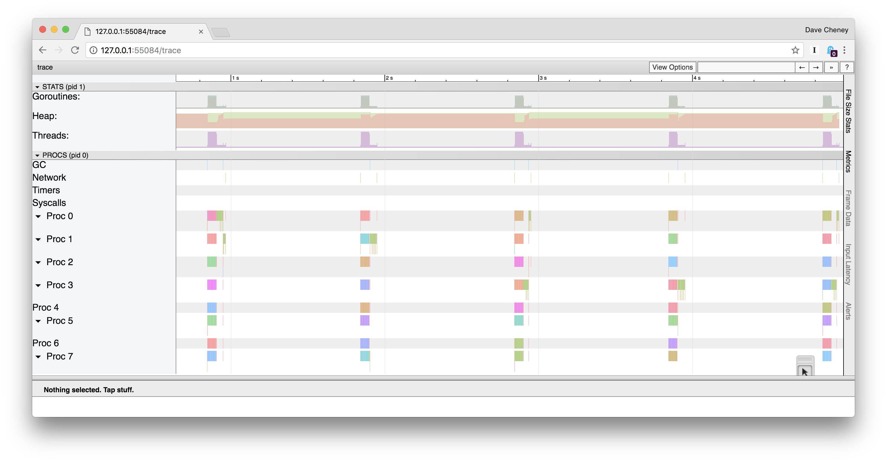
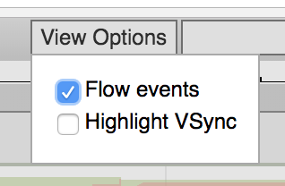
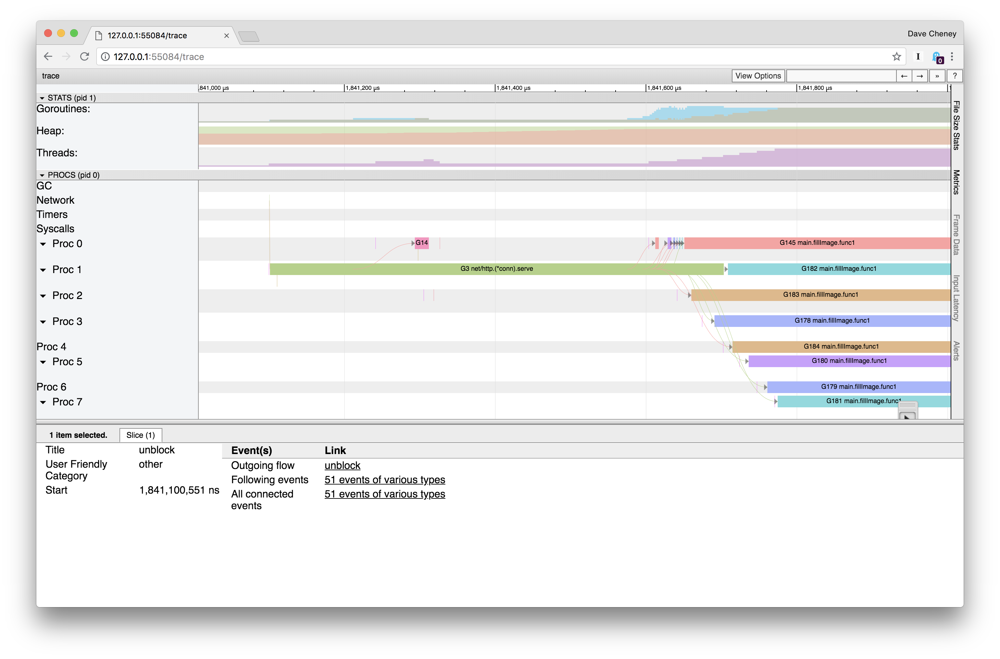
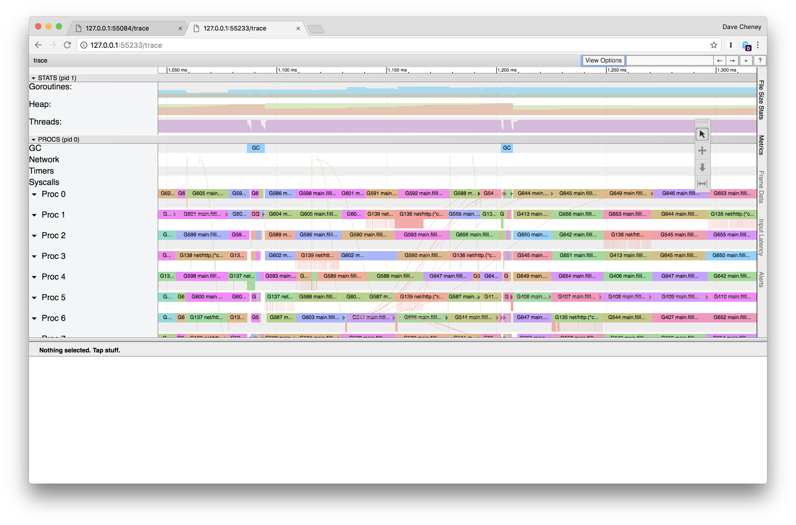

# Mandelbrot microservice

It's 2018, generating Mandelbrots is pointless unless you can offer them on the internet as a web service.

Thus, I present to you, _Mandelweb_

```
% go run mandelweb/mandelweb.go
2018/08/27 01:53:33 listening on http://127.0.0.1:8080/
```

Now visit [http://127.0.0.1:8080/mandelbrot]

## Tracing a running application

In the previous examples today we've run the execution tracer from the start to the end of a programs execution.

As you saw, traces can be very large, even for small amounts of time, so collecting trace data continually in production would generate far too much data. Also, tracing can have an impact on the speed of your program, especially if there is a lot of activity.

What we want is a way to collect a short trace from a running program.

Fortuntately, the `net/http/pprof` package has just such a facility.

## Collecting traces via http

Hopefully everyone knows about the `net/http/pprof` package.

When imported
```go
import _ "net/http/pprof"
```

It will register tracing and profiling routes with `http.DefaultServeMux`. Since Go 1.5 this includes the trace profiler.

We can grab a five second trace from mandelweb with `curl` (or `wget`)
```
% curl -o trace.out http://127.0.0.1:8080/debug/pprof/trace?seconds=5 
```

## Generating some load

The previous example was interesting, but an idle webserver has, by definition, no performance issues. We need to generate some load. For this I'm using [hey][0] by JDB.

```
% go get -u github.com/rakyll/hey
```

Let's start with one request per second.
```
% hey -c 1 -n 1000 -q 1  http://127.0.0.1:8080/mandelbrot
```

And with that running, in another window collect the trace
```
% curl -o trace.out http://127.0.0.1:8080/debug/pprof/trace?seconds=5
  % Total    % Received % Xferd  Average Speed   Time    Time     Time  Current
                                 Dload  Upload   Total   Spent    Left  Speed
100 65098    0 65098    0     0  13009      0 --:--:--  0:00:05 --:--:-- 17117
% go tool trace trace.out
2018/08/27 02:07:09 Parsing trace...
2018/08/27 02:07:09 Splitting trace...
2018/08/27 02:07:09 Opening browser. Trace viewer is listening on http://127.0.0.1:55084 
```


We see a regular pattern of activity. Zooming into one of these clusters and turning on flow events.



We can trace the request coming from the network row, to our goroutine waiting in `net/http.(*conn).serve`, and from there into the body of our mandelbrot routine.



## Simulating overload

Let's increase the rate to 5 requests per second.
```
% hey -c 5 -n 1000 -q 5 http://127.0.0.1:8080/mandelbrot
```
And with that running, in another window collect the trace
```
% curl -o trace.out http://127.0.0.1:8080/debug/pprof/trace?seconds=5
  % Total    % Received % Xferd  Average Speed   Time    Time     Time  Current
                                 Dload  Upload   Total   Spent    Left  Speed
100  687k    0  687k    0     0   135k      0 --:--:--  0:00:05 --:--:--  178k
% go tool trace trace.out
2018/08/27 02:16:22 Parsing trace...
2018/08/27 02:16:23 Splitting trace...
2018/08/27 02:16:23 Opening browser. Trace viewer is listening on http://127.0.0.1:55233
```
And we see something like this



Explain what you see in this trace.

## Further reading

- [Go's execution tracer][1] Rhys Hiltner (dotGo 2016)
- [An Introduction to "go tool trace"][2] Rhys Hiltner (GopherCon 2017)
- [Seven ways to profile Go programs][3] Dave Cheney (GolangUK 2016)
- [Visualizing Concurrency in Go][4] Ivan Daniluk (GopherCon 2016)
- [Understanding Channels][5] Kavya Joshi (GopherCon 2017)

[0]: https://github.com/rakyll/hey
[1]: https://www.youtube.com/watch?v=mmqDlbWk_XA
[2]: https://www.youtube.com/watch?v=V74JnrGTwKA
[3]: https://www.youtube.com/watch?v=2h_NFBFrciI
[4]: https://www.youtube.com/watch?v=KyuFeiG3Y60
[5]: https://www.youtube.com/watch?v=KBZlN0izeiY

